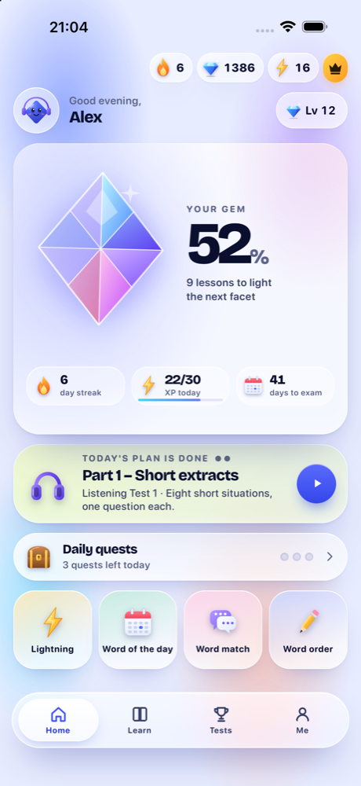
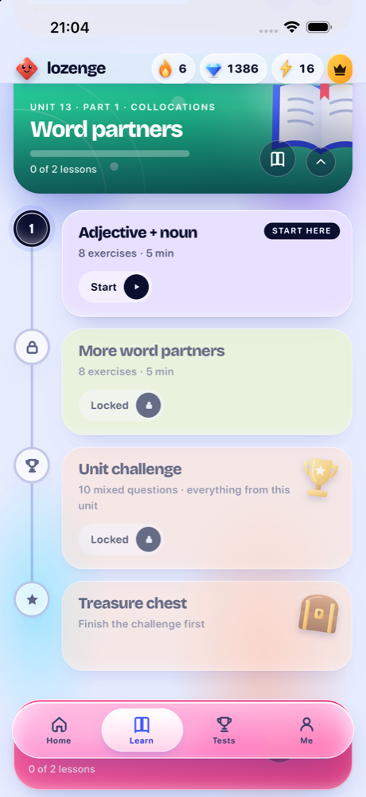
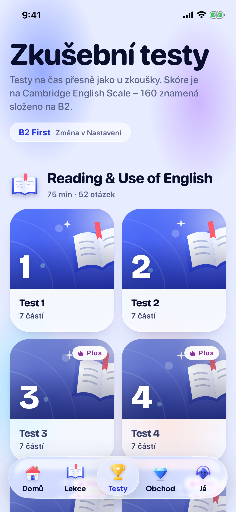
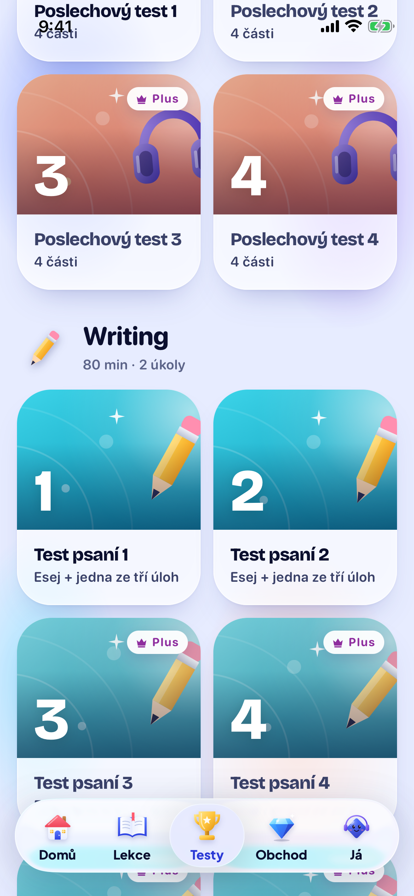
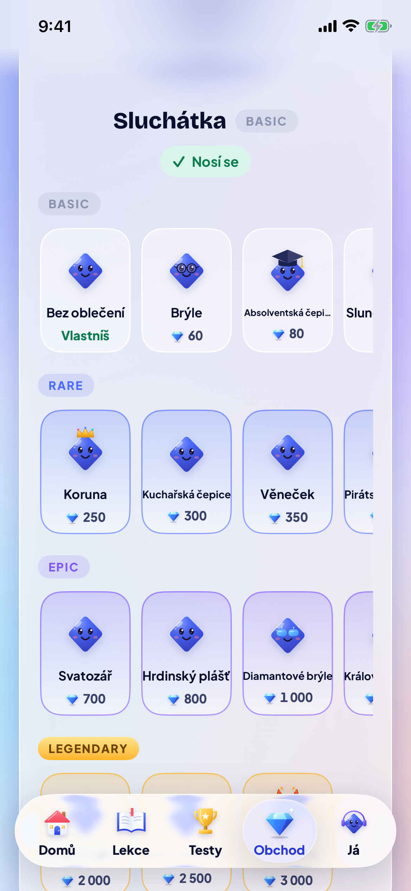
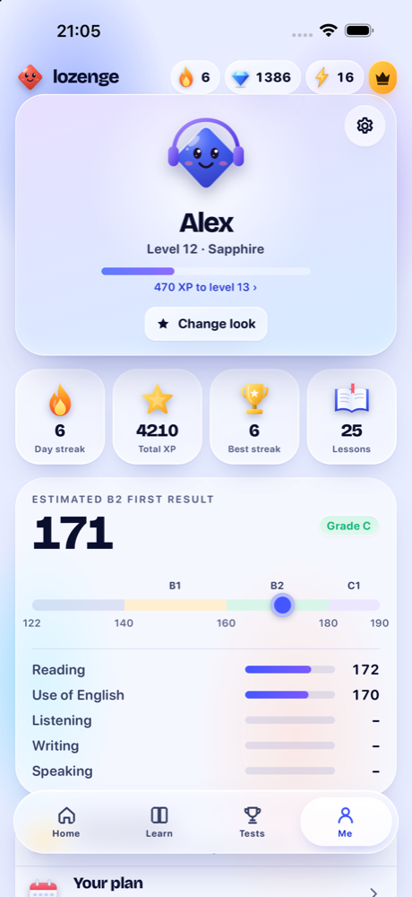

  

<h1 align="center">Lozenge</h1>

  <b>Practice for the Cambridge English exams, a few minutes at a time.</b> 
  <a href="https://entexik.github.io/lozenge-app/">entexik.github.io/lozenge-app</a> 
  B1 Preliminary · B2 First · C1 Advanced

  
  
  

  

I'm a student from Czechia and I built Lozenge while getting ready for Cambridge exams myself. The books
were fine but boring, and the apps I tried didn't teach the actual exam tasks. So this is both: short
lessons you can do on the bus, and full timed tests that look like the real papers.

Lessons use the same task types as the exam (gap fills, word formation, key word transformations and so
on). After a mock test you get an estimated score on the Cambridge English Scale, so you can see roughly
where you stand.

There's also a streak, gems and a mascot called Lozzy you can dress up. It sounds silly, but it's what got
me to open the app every day.

## What's in it

You pick one exam and the lessons, tests and daily plan follow it.

| | Reading &amp; Use of English | Listening | Writing | Speaking | Lesson units | Pass mark |
|---|:---:|:---:|:---:|:---:|:---:|:---:|
| **B1 Preliminary** | 10 papers | 4 tests | 4 papers | 4 tests | 20 | 140 |
| **B2 First** | 8 papers | 4 tests | 8 papers | 7 tests | 29 | 160 |
| **C1 Advanced** | 10 papers | 4 tests | 4 papers | 4 tests | 20 | 180 |

About 1,100 exercises and 444 recordings. All the texts and exercises are written from scratch in the
exam format; nothing is copied from Cambridge. The recordings use synthetic British voices, which is the
one thing I'd like to improve.

A few more details:

- Listening extracts can be slowed down to 0.75× while you practise.
- Writing is marked by an AI examiner on the four official criteria. It shows what you did well, what to
  fix and a better version of your own text. It asks before sending anything.
- Speaking checks your pace, pauses and vocabulary range.
- Tests can run in a strict mode: timer on, no hints, no leaving.
- Reminders (up to five a day, or off) stop once you've done something that day.
- The interface is in 16 languages, including Czech and Slovak. The exam material stays in English.

## Screenshots

<table>
  <tr>
    <td align="center"> Home</td>
    <td align="center"> Your path</td>
    <td align="center"> Mock tests</td>
  </tr>
  <tr>
    <td align="center"> Writing papers</td>
    <td align="center"> Wardrobe</td>
    <td align="center"> Your progress</td>
  </tr>
</table>

## Install

**Android** – download [`Lozenge.apk`](https://github.com/Entexik/lozenge-app/releases/latest/download/Lozenge.apk),
open it and allow your browser to install apps when Android asks. Android 8.0 or newer.
This is a beta: everything that's free works, and Plus can't be bought yet. When Lozenge arrives on
Google Play, uninstall this version first.

**iPhone** – coming to the App Store. Until then, use the [web version](https://entexik.github.io/lozenge-app/app/)
in Safari.

**Web** – [try it in your browser](https://entexik.github.io/lozenge-app/app/). Everything that's free in
the app is free there too. On iPhone, tap Share › Add to Home Screen and it opens like an app.

## Česky

Lozenge je aplikace na přípravu ke zkouškám Cambridge B1 Preliminary, B2 First a C1 Advanced. Dělám ji
jako student, protože jsem nic podobného v češtině nenašel. Jsou v ní krátké lekce, testy na čas
s odhadem skóre, poslech, psaní s hodnocením a mluvení. Rozhraní je česky.
[APK pro Android](https://github.com/Entexik/lozenge-app/releases/latest/download/Lozenge.apk) ·
[verze do prohlížeče](https://entexik.github.io/lozenge-app/app/)

## Feedback

If you find a wrong answer in an exercise or something that doesn't work, please [open an issue](https://github.com/Entexik/lozenge-app/issues). It helps a lot.

---

Lozenge is an independent practice app and isn't affiliated with Cambridge University Press &amp; Assessment.
All texts, recordings and exercises are original. [Privacy policy](https://entexik.github.io/lozenge-app/privacy.html) · © 2026 Lozenge. All rights reserved.
