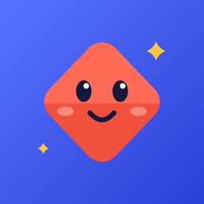
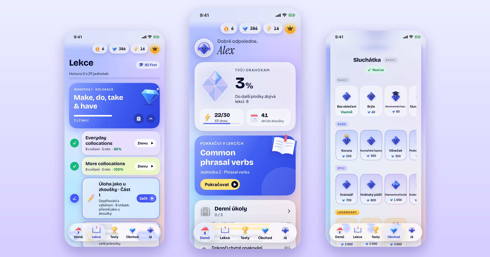
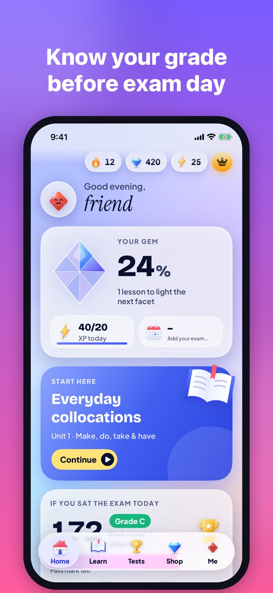
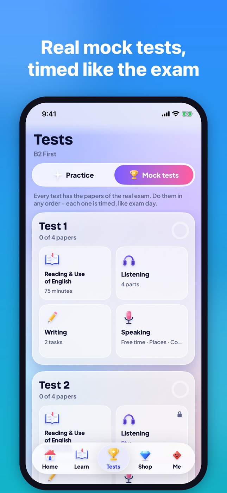
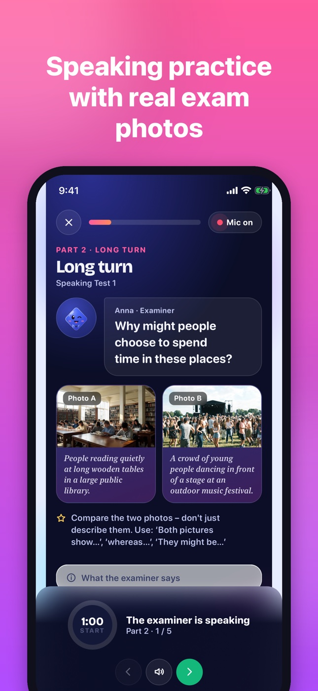
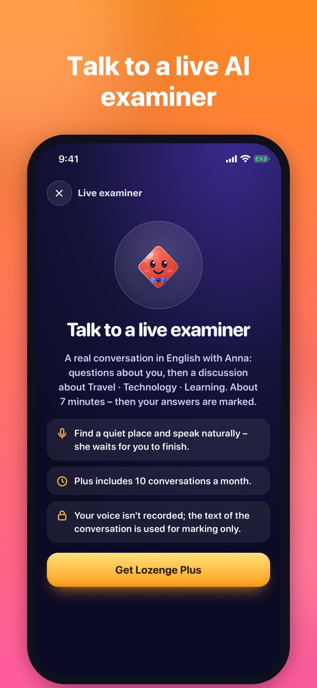
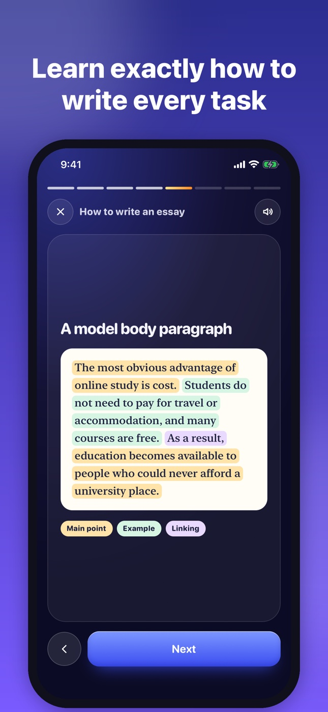
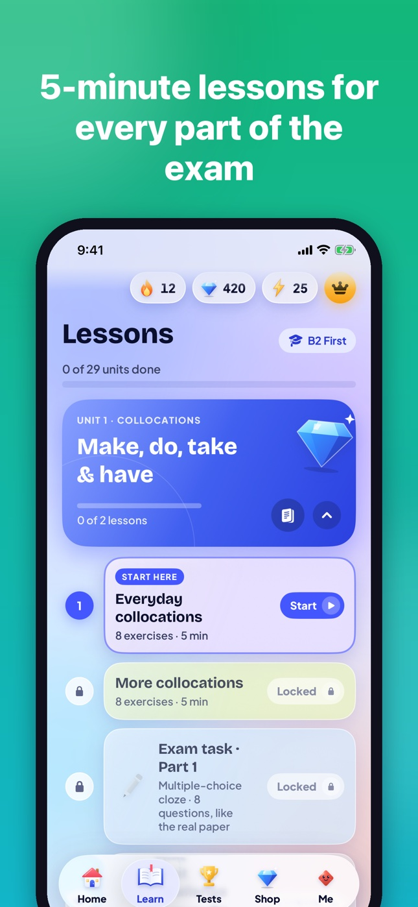

  

<h1 align="center">Lozenge</h1>

  <b>Practice for the Cambridge English exams, a few minutes at a time.</b> 
  <a href="https://entexik.github.io/lozenge-app/">entexik.github.io/lozenge-app</a> 
  B1 Preliminary · B2 First · C1 Advanced

  
  
  

  

Lozenge is a practice app for the Cambridge English exams, made by a student from Czechia. Most apps
teach general English, and most exam books aren't much fun, so Lozenge tries to do both: short lessons
you can do on the bus, and full timed tests that look like the real papers.

Lessons use the same task types as the exam (gap fills, word formation, key word transformations and so
on). Every mock test gives you a score on the Cambridge English Scale, and Home shows the grade you'd get
if you sat the exam today – and which paper would gain you the most.

There's also a streak, gems and a mascot called Lozzy you can dress up, so there's a small reason to come
back tomorrow.

## What's in it

You pick one exam and the lessons, tests and daily plan follow it.

| | Reading &amp; Use of English | Listening | Writing | Speaking | Lesson units | Pass mark |
|---|:---:|:---:|:---:|:---:|:---:|:---:|
| **B1 Preliminary** | 10 papers | 4 tests | 4 papers · 12 tasks | 6 tests | 20 | 140 |
| **B2 First** | 8 papers | 4 tests | 8 papers · 34 tasks | 7 tests | 29 | 160 |
| **C1 Advanced** | 10 papers | 4 tests | 4 papers · 16 tasks | 6 tests | 20 | 180 |

Over 2,000 exam-style questions, 740 recordings and 150 listening reels. All the texts and exercises are
written from scratch in the exam format; nothing is copied from Cambridge. The recordings use synthetic
British voices.

- **Mock tests and Exam day** – timed papers with the real parts and questions, or a whole test in one go,
  in the real order with breaks, ending with one overall grade.
- **A live AI examiner** (Plus) – a spoken conversation with Anna, the examiner, or Speaking Part 3 with
  Tom, another candidate, like on the day. Your speaking is then marked on the official criteria.
- **Writing, marked** – essays, emails, articles and reviews marked on the four official criteria, with
  corrections and a stronger version of your own text. Wrote it by hand? Take a photo.
- **“Why?”** – tap it under a wrong answer and the mistake is explained in your language.
- **Speaking practice** – exam-style photos, your pace, pauses and range, and the words to practise saying.
- **Listening reels** – short scenes with British voices and video; save new words from the transcript.
- **Exam guides** – how to write each task and handle every Speaking part, card by card, read aloud.
- **Your goal and your week** – choose a pass, Grade B or Grade A; Home shows how far you are, and every
  Sunday you get your week in numbers.
- **Classes** – a teacher creates a class and shares its code; students join and the teacher sees each
  student's predicted score and weakest paper (never their answers).
- **Smart review** – every mistake comes back right before you'd forget it.
- The interface is in 16 languages, including Czech, Slovak, Turkish and Ukrainian. The exam material
  stays in English.

## Screenshots

<table>
  <tr>
    <td align="center"> Home</td>
    <td align="center"> Mock tests</td>
    <td align="center"> Speaking</td>
  </tr>
  <tr>
    <td align="center"> Live examiner</td>
    <td align="center"> Exam guides</td>
    <td align="center"> Your path</td>
  </tr>
</table>

## Install

**Android** – Lozenge is in testing on Google Play and arrives there for everyone soon. Until then, download
[`Lozenge.apk`](https://github.com/Entexik/lozenge-app/releases/latest/download/Lozenge.apk), open it and
allow your browser to install apps when Android asks. Android 8.0 or newer. When you install it from
Google Play later, uninstall this version first.

**iPhone** – coming to the App Store. Until then, use the [web version](https://entexik.github.io/lozenge-app/app/)
in Safari: tap Share › Add to Home Screen and it opens like an app.

**Web** – [try it in your browser](https://entexik.github.io/lozenge-app/app/). Everything that's free in
the app is free there too.

What changed in each version: [releases](https://github.com/Entexik/lozenge-app/releases).

## Česky

Lozenge je aplikace na přípravu ke zkouškám Cambridge B1 Preliminary, B2 First a C1 Advanced. Dělá ji
student z Česka. Jsou v ní krátké lekce, zkušební testy na čas a Den zkoušky s celkovou známkou, živý
AI zkoušející (i s druhým kandidátem v Part 3), psaní s hodnocením (i z fotky ručně psaného textu),
vysvětlení chyb česky, poslechové reels, průvodci zkouškou a třídy pro učitele. Rozhraní je česky.
[APK pro Android](https://github.com/Entexik/lozenge-app/releases/latest/download/Lozenge.apk) ·
[verze do prohlížeče](https://entexik.github.io/lozenge-app/app/)

## Feedback

If you find a wrong answer in an exercise or something that doesn't work, please [open an issue](https://github.com/Entexik/lozenge-app/issues). It helps a lot.

---

Lozenge is an independent practice app and isn't affiliated with Cambridge University Press &amp; Assessment.
All texts, recordings and exercises are original. [Privacy policy](https://entexik.github.io/lozenge-app/privacy.html) · © 2026 Lozenge. All rights reserved.
