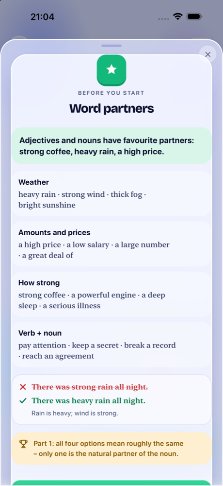
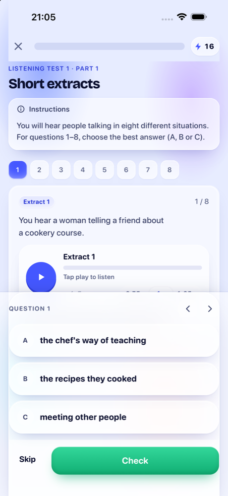
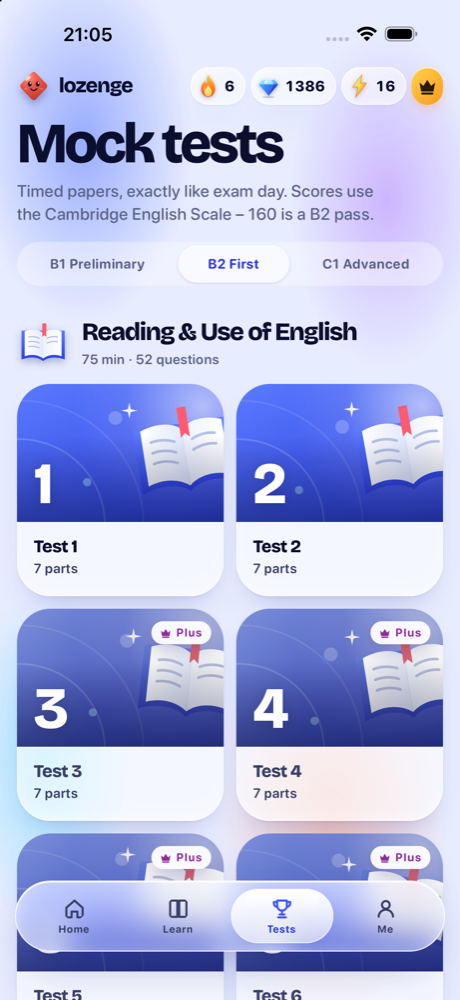

  

<h1 align="center">Lozenge</h1>

  <b>Pass your Cambridge English exam, ten minutes a day.</b> 
  <a href="https://entexik.github.io/lozenge-app/">entexik.github.io/lozenge-app</a> 
  B1 Preliminary · B2 First · C1 Advanced

  
  
  

  

Lozenge turns Cambridge exam preparation into short, game-like lessons. Tap the right word, build the
sentence, spot the mistake – every answer explains itself, and your mistakes come back just before you
would forget them. When you're ready, sit a timed mock test and see your score on the **Cambridge English
Scale**, the same scale your certificate uses.

Every lesson lights another facet of your gem. Keep the streak going, earn gems, open chests and climb
the weekly league.

## Three exams, every paper

Pick your exam and the whole app follows it: the lessons, the mock tests and your daily plan.

| | Reading &amp; Use of English | Listening | Writing | Speaking | Lesson units | Pass mark |
|---|:---:|:---:|:---:|:---:|:---:|:---:|
| **B1 Preliminary** | 10 papers | 4 tests | 10 tasks | 4 tests | 20 | 140 |
| **B2 First** | 8 papers | 4 tests | 28 tasks | 7 tests | 29 | 160 |
| **C1 Advanced** | 10 papers | 4 tests | 10 tasks | 4 tests | 20 | 180 |

Over **1,100 exercises** and **444 recordings** with natural British voices. Everything is original and
written in the exam's format.

## What's inside

- **Ten-minute lessons** – grammar and vocabulary in the exam's own formats: multiple-choice cloze, open
  cloze, word formation and key word transformations, plus quick checks like "spot the mistake".
- **Mock tests like exam day** – timed papers with the real number of parts and questions, then a score on
  the Cambridge English Scale and a review of every answer.
- **Listening** – announcements, conversations, interviews and talks, one extract at a time in practice.
  Slow them to 0.75× while you learn, then take them at exam speed.
- **Writing and Speaking, marked** – the AI examiner marks your writing on the four official criteria and
  shows a stronger version of your own answer (it always asks before anything is sent). Speaking measures
  your pace, pauses and range.
- **A reason to come back** – streaks and streak freezes, daily quests, a weekly league, badges and four
  quick word games.
- **In your language** – the interface speaks 16 languages, including Czech and Slovak. The exam material
  stays in English, exactly as you'll meet it on the day.

## Screenshots

<table>
  <tr>
    <td align="center"> Home</td>
    <td align="center"> Your path</td>
    <td align="center"> A lesson</td>
  </tr>
  <tr>
    <td align="center"> Listening</td>
    <td align="center"> Mock tests</td>
    <td align="center"> Your score</td>
  </tr>
</table>

## Install

**Android** – download [`Lozenge.apk`](https://github.com/Entexik/lozenge-app/releases/latest/download/Lozenge.apk),
open it and allow your browser to install apps when Android asks. Android 8.0 or newer.
This is a beta: everything that's free works, and Plus can't be bought yet. When Lozenge arrives on
Google Play, uninstall this version first.

**iPhone** – coming to the App Store. Until then, use the [web version](https://entexik.github.io/lozenge-app/app/)
in Safari.

**Web** – [try it in your browser](https://entexik.github.io/lozenge-app/app/). Everything that's free in
the app is free there too. On iPhone, tap Share › Add to Home Screen and it opens like an app.

## Česky

Lozenge tě připraví na zkoušky Cambridge **B1 Preliminary, B2 First a C1 Advanced** – desetiminutové
lekce, zkušební testy na čas se skóre na Cambridge English Scale, poslech s britskými hlasy a hodnocené
psaní i mluvení. Rozhraní je česky i v dalších 15 jazycích.
[Stáhni si APK pro Android](https://github.com/Entexik/lozenge-app/releases/latest/download/Lozenge.apk)
nebo si ho [vyzkoušej v prohlížeči](https://entexik.github.io/lozenge-app/app/).

## Feedback

Found a mistake in an exercise, or something that doesn't work? [Open an issue](https://github.com/Entexik/lozenge-app/issues).

---

Lozenge is an independent practice app and isn't affiliated with Cambridge University Press &amp; Assessment.
All texts, recordings and exercises are original. [Privacy policy](https://entexik.github.io/lozenge-app/privacy.html) · © 2026 Lozenge. All rights reserved.
